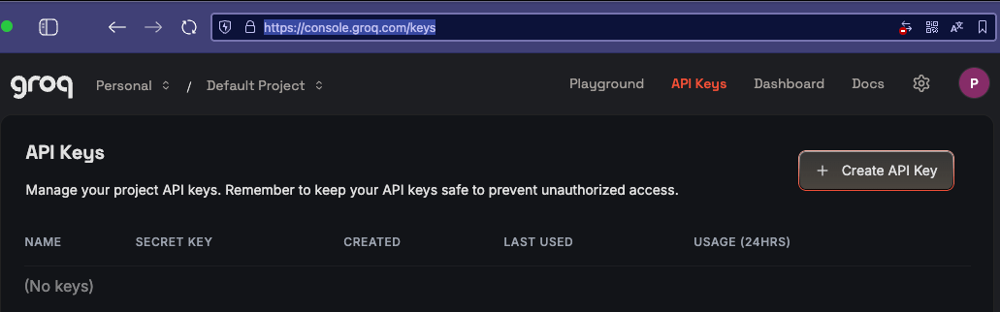
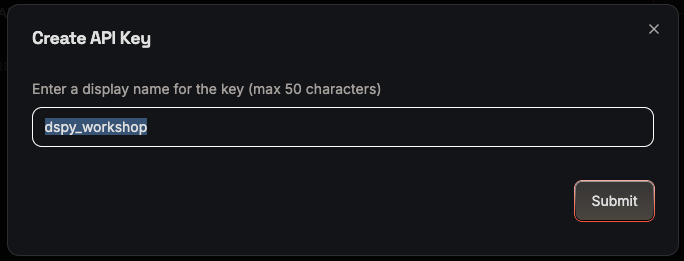
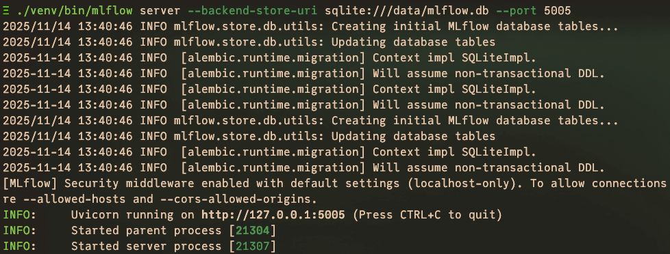
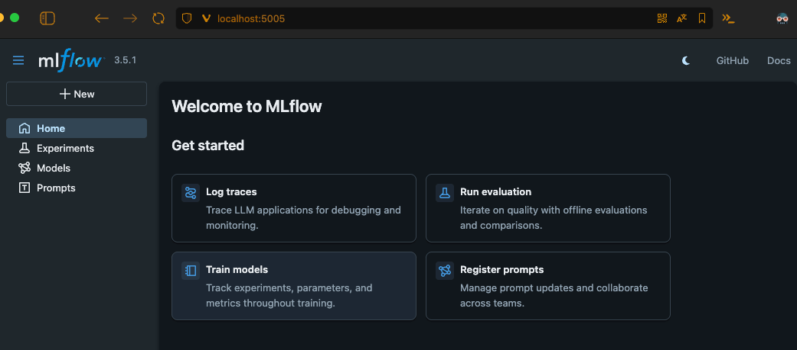

# From Prompts to Programs in 120 Minutes (DSPy Workshop)

PyCon Ireland 2025

## What You'll Learn

* What is DSPy and it's building blocks
* How to structure your prompts as Python code
* How to make multi-step pipelines
* How to evaluate and optimize your LLM applications

Groq provides free tier access. We will be using `Llama 3.1 8B` model and `GPT OSS 20B` model for the workshop.

## Pre-requisites

* Python 3.12+
* Git

## Quick Start

### Clone and Setup

1. Install `uv` fast Python package and project manager

[uv instalation page](https://docs.astral.sh/uv/getting-started/installation/)

2. Download project repository

```bash
git clone https://github.com/Pencroff/dspy_workshop.git
```

3. Enter workshop directory

```bash
cd dspy_workshop
```

4. Create virtual environment and install dependencies

```bash
uv venv --python 3.12 venv
```
and activate it
```bash
source venv/bin/activate  # On Windows: venv\Scripts\activate
```

5. Instal dependencies

```bash
uv pip install -r requirements.txt
```

### Register on Groq

1. Open [Groq](https://console.groq.com/home) and register for free account.
2. Open [API Keys](https://console.groq.com/keys) page



3. Click on `Create API Key` button and save your API key.
4. In open pop-up enter key name: `dspy_workshop` and click `Submit` button.



5. Copy your API key and save it in `.env` file.


`.env` file should look like this:

```dotenv
GROQ_API_KEY= gsk_YXEdbRF7...   # your_api_key
```

### Run Jupyter Notebooks

Run from workshop directory `dspy_workshop`:

```bash
./venv/bin/jupyter lab
```

it will open Jupyter Notebook in your browser on the page: http://localhost:8888/tree


### Validate Setup

Open `notebooks/00_setup_check.ipynb` notebook and run all cells.


### Run MLflow

Open a separate terminal and run MLflow server.

Activate virtual environment:

```bash
source venv/bin/activate
```

Run MLflow server:

```bash
./venv/bin/mlflow server --backend-store-uri sqlite:///data/mlflow.db --port 5005
```



Check MLflow UI at http://localhost:5005/ or http://127.0.0.1:5005

We will need it for evaluation and optimization notebooks.



## Agenda

1. Welcome & Framing - 15 mins (pre-check notebook/00_setup_check.ipynb)
2. Setup & First LLM Call - 15 mins (notebooks/01_first_call.ipynb)
3. Core Concepts - 15 mins (notebooks/02_core_concepts.ipynb)
4. Multi-step Pipeline - 15 mins (notebooks/03_pipeline.ipynb)
5. Break - 5 mins
6. Evaluation & Metrics - 20 mins (notebooks/04_evaluation.ipynb)
7. Optimization Demo - 20 mins (notebooks/05_optimization_demo.ipynb)
8. Wrap Session - 5 mins

## Dataset

Twenty syntectic examples of Python snippets with syntax errors and possible logical issues.
Structure of the dataset element:
```yaml
  id: number
  name: short description
  comment: context of the example and issue
  traceback: traceback of the error, usually syntax error
  content: snippet of the code
  test_case: assert test case, verifies the correctness of the code
```

## API providers

Bellow few providers that have free tier (might not be the best for optimization):

* [Groq](https://console.groq.com/docs/rate-limits) - estimated price a few cents for workshop
* [Open Router](https://openrouter.ai)
  * Filter for `:free` models in their model list
* [Google AI Studio](https://aistudio.google.com/api-keys)
* And many others...

## References

* Paper: [Syntax and Stack Overflow: A methodology for extracting a corpus of syntax errors and fixes](https://arxiv.org/abs/1907.07803)
* Original dataset: [Python3_6_Natural_Syntax_Errors_and_Corrections](https://figshare.com/articles/dataset/Python3_6_Natural_Syntax_Errors_and_Corrections/8244686/1)
* Dataframe: [pandas](https://pandas.pydata.org)
* LiteLLM: [litellm](https://docs.litellm.ai/docs/)
* MLflow: [mlflow](https://mlflow.org)
* [Evaluating and Optimizing LLM Applications with DSPy](https://pedramnavid.com/blog/dspy-evals/)
* [MAGIC of DSPY 3](https://www.youtube.com/watch?v=1067jj67toY)
* [DSPy Tutorial | Build AI Agents with Python](https://www.youtube.com/watch?v=fXjCleTYUm8)
* [The Evaluator–Optimizer Pattern in DSPy with GEPA](https://www.youtube.com/watch?v=gstt7E65FRM)
